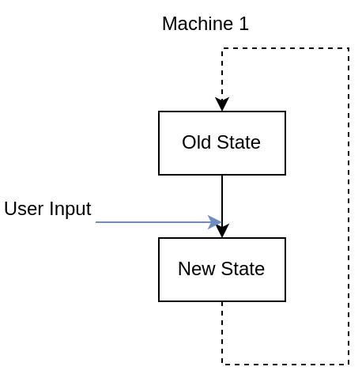
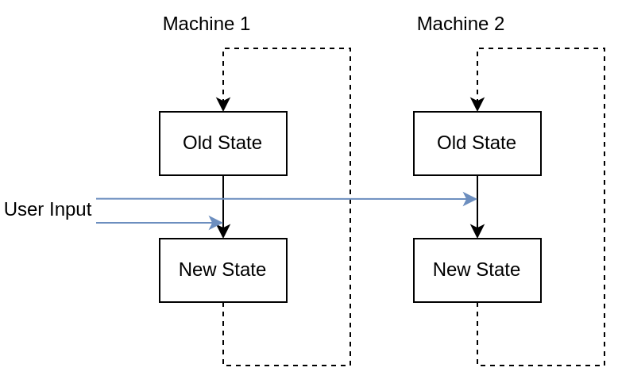
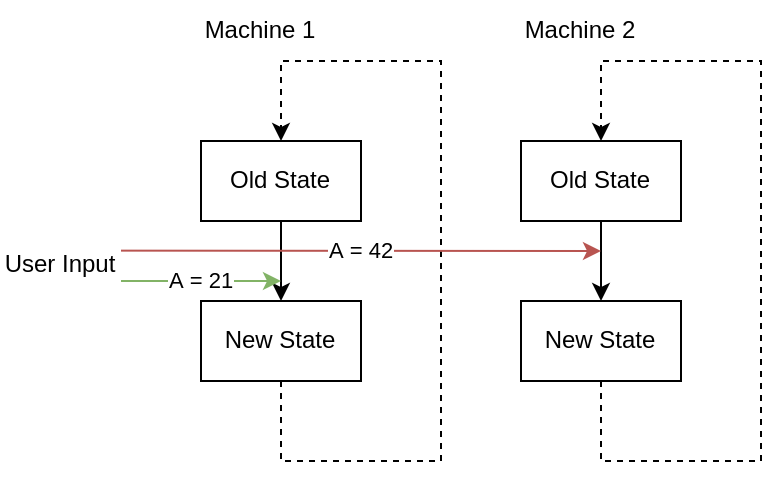
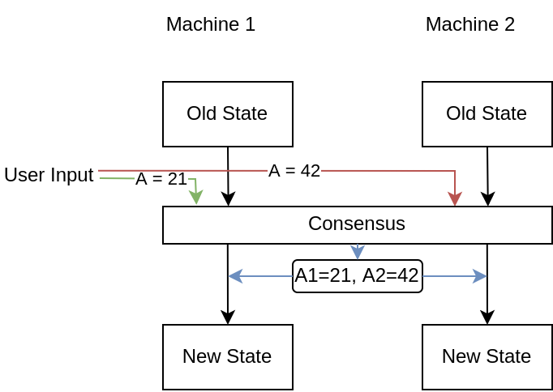

# Workshop Advancing Bitcoin: Building Fedimint Modules

## Dev setup
* This may take a while, so let's do this first
* [We use a Nix-based developer environment, see documentation for details.](docs/dev-env.md)

## What is Fedimint?
Fedimint is a federated e-cash system written in Rust with an extensible module system that allows building other
(financial) applications using it.

* [Adopting Bitcoin 2022 slides](https://sirion.io/p/Adopting%20Bitcoin%202022-2.pdf)
* [Adopting Bitcoin 2022 recording](https://www.youtube.com/watch?v=JrGr8M6hB2w&list=PLN2-dhqIYoj-e3NwSpBRz9IodY6ZgDioa&index=4)

## Fedimint Modular Architecture
### State machines and their replication

Basic state machine with user input:

Replicate state machine with user input:

Problem: Equivocation

Solution: Consensus

### Fedimint Module System

* [Transaction Lifecycle](https://github.com/fedimint/fedimint/blob/master/docs/lifecycle.md)
* [`ServerModule` trait](https://github.com/fedimint/fedimint/blob/0ec0f305b604a8aa33f5cb3ecd02b671aba7148f/fedimint-core/src/module/mod.rs#L630-L778)
* [`ModuleGen` trait](https://github.com/fedimint/fedimint/blob/0ec0f305b604a8aa33f5cb3ecd02b671aba7148f/fedimint-core/src/module/mod.rs#L408-L474)

## Existing Modules

Core:
* Wallet: holding on on-chain BTC
* Mint: issuing of e-cash IOUs
* Lightning: smart contracts to incentivize LN gateways to pay invoices for users

External:
* [Stability Pools](https://github.com/stability-pool/fedimint)

Ideas: [see discussions](https://github.com/fedimint/fedimint/discussions/categories/fedimint-modules)

## Builing your first own module
Idea:
* Generate consensus on BTC price
* Allow betting on price every n minutes (TODO)

### Step 0: Dev setup
[We use a Nix-based developer environment, see documentation for details.](docs/dev-env.md)

### Step 1: Add a dummy module
* There already is a [dummy module in the repository](https://github.com/fedimint/fedimint/tree/master/modules/fedimint-dummy)
* We just need to add it to `fedimintd`

### Step 2: Implement consensus on price
* Add price API endpoint to config
* Use module consensus items 
* Returned by [`ServerModule::consensus_proposal`](https://github.com/fedimint/fedimint/blob/3f9e4b59884b5ea495cb36f4f8398df133ff97dc/fedimint-core/src/module/mod.rs#L659) each epoch
* Given to [`begin_consensus_epoch`](https://github.com/fedimint/fedimint/blob/3f9e4b59884b5ea495cb36f4f8398df133ff97dc/fedimint-core/src/module/mod.rs#LL669C14-L669C35) as input after consensus is achieved and gets processed there
* Add API endpoint to see last round price `cargo run --bin fedimint-cli -- --workdir cfg/advancing/ api "/module/3/last_bet"`

### Step 3: Implement bet smart contract (TODO)
* Create struct saved to DB containing bet details
* Implement deposit/withdraw functionality by defining module transaction inputs and outputs
* Define withdraw logic that limits who can withdraw when
* Implement audit function so there's no discrepancy making Fedimint crash

### Step 4: Implement client (TODO)
* Fund and save bet
* Redeem bet if won
